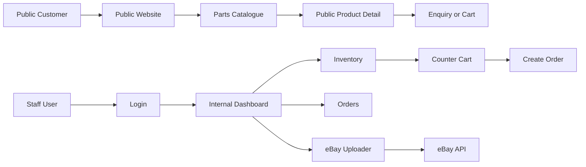
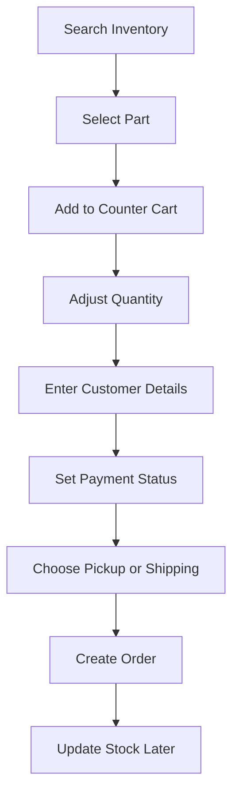
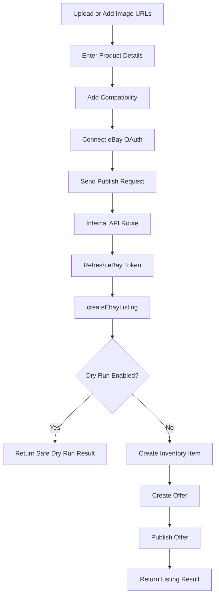
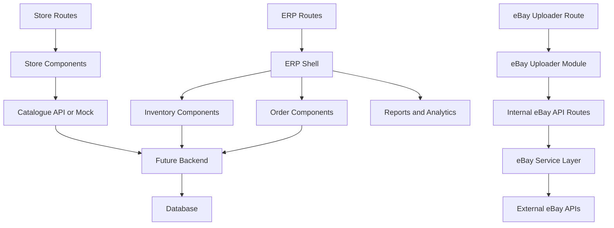

# Parts Hub Australia Platform BRD

## 1. Executive Summary
Parts Hub Australia is a combined automotive parts platform with two main product areas:

- A public customer-facing website for browsing, searching, and enquiring about automotive parts.
- An internal staff dashboard / ERP for inventory, orders, counter sales, reporting, and marketplace operations.

The platform must also include a lightweight internal eBay uploader so staff can quickly create and publish automotive parts listings without disrupting the core inventory workflow.

This document explains the full project from scratch so developers can understand what needs to be built, how the modules should be separated, and what the UI should roughly look like.

## 2. Project Goals
- Build a modern automotive parts website for customers.
- Let customers search products by vehicle fitment, SKU, category, brand, condition, stock, and price.
- Give staff a fast internal dashboard to manage inventory, orders, counter sales, and listings.
- Provide a simple eBay uploader tool for operational listing work.
- Keep the public website, internal ERP, and eBay uploader clearly separated.
- Prepare the project for future database, payment, shipping, authentication, and eBay production integrations.

## 3. Target Users
### Public Customer
Customers use the website to:

- Browse automotive parts.
- Search by make, model, year, engine, keyword, SKU, category, brand, and price.
- View product detail pages with images, compatibility, price, and stock.
- Add products to cart or send an enquiry.

### Staff / Counter Sales
Staff use the ERP to:

- Search inventory quickly.
- View product stock, pricing, cost, supplier, and bin location.
- Add products to a counter cart.
- Create walk-in, phone, or internal orders.
- Track order/payment/fulfilment status.

### Listing Operator
Listing operators use the eBay uploader to:

- Upload or preview product images.
- Enter listing details.
- Add vehicle compatibility.
- Connect eBay account.
- Publish or dry-run eBay listings.

### Manager / Admin
Managers use the system to:

- Review dashboard KPIs.
- Track stock and orders.
- View reports and analytics.
- Manage settings and future integrations.

## 4. Main Platform Areas


## 5. Public Website Requirements
The public website is the customer-facing storefront. It should look like a professional automotive parts website, similar in structure to Repco, Supercheap Auto, or FCP Euro.

### Public Website Routes
Recommended routes:

```text
/
/parts
/parts/[slug]
/search
/brands
/about
/contact
/cart
/account
```

### Public Website Features
- Premium automotive parts homepage.
- Product catalogue with filters.
- Product cards with image, title, SKU, price, and stock status.
- Retail-style product detail page.
- Cart placeholder or real cart, depending on project phase.
- Enquiry form for customers.
- SEO-friendly pages and metadata.

## 6. Storefront Product Catalogue
The catalogue must support the following filters:

- Keyword
- SKU
- VIN placeholder
- Make
- Model
- Year
- Engine
- Brand
- Category
- Condition
- Genuine / aftermarket type
- In-stock only
- Warehouse
- Minimum price
- Maximum price

### Mockup: Public Parts Catalogue
```text
┌──────────────────────────────────────────────────────────────────────────────┐
│ Parts Hub Australia                                                         │
│ [Search by part name, SKU, make, model...]                         [Cart]   │
├──────────────────────────────────────────────────────────────────────────────┤
│ Filters                         │ Product Results                            │
│ ─────────────────────────────── │ ┌──────────────┐ ┌──────────────┐         │
│ Keyword                         │ │ Product Img   │ │ Product Img   │         │
│ Make                            │ │ Brake Pads    │ │ Oil Filter    │         │
│ Model                           │ │ SKU           │ │ SKU           │         │
│ Year                            │ │ $289 inc GST  │ │ $42.50        │         │
│ Engine                          │ │ In Stock      │ │ In Stock      │         │
│ Brand                           │ └──────────────┘ └──────────────┘         │
│ Category                        │ ┌──────────────┐ ┌──────────────┐         │
│ Condition                       │ │ Product Img   │ │ Product Img   │         │
│ Stock                           │ │ Product Name  │ │ Product Name  │         │
│ Price Range                     │ │ Price         │ │ Price         │         │
└──────────────────────────────────────────────────────────────────────────────┘
```

## 7. Public Product Detail Page
The public product detail page must be retail-focused, not staff/ERP-focused.

### Required UI Elements
- Breadcrumbs.
- Image gallery with thumbnails.
- Product brand.
- Product title.
- SKU / part number.
- Price and GST label.
- Stock status.
- Quantity selector.
- Add to cart button.
- Compatibility / fitment section.
- Delivery/shipping information.
- Enquiry form.
- Related products.

### Mockup: Public Product Detail Page
```text
┌──────────────────────────────────────────────────────────────────────────────┐
│ Parts > Brakes > Mercedes-Benz > MB-BP-W205-OEM                             │
├──────────────────────────────────────────────────────────────────────────────┤
│                                                                              │
│ ┌────────┐ ┌──────────────────────────────┐   ┌────────────────────────────┐ │
│ │ Thumb  │ │                              │   │ Part # MB-BP-W205-OEM      │ │
│ │ Thumb  │ │        MAIN PRODUCT          │   │ Mercedes-Benz              │ │
│ │ Thumb  │ │           IMAGE              │   │ OEM Front Brake Pad Set     │ │
│ │ Thumb  │ │                              │   │                            │ │
│ └────────┘ └──────────────────────────────┘   │ Your price                 │ │
│                                               │ $289.00 inc GST            │ │
│                                               │ In stock                   │ │
│                                               │ Qty [ 1 ] [ Add to Cart ]  │ │
│                                               │ [ Continue Shopping ]      │ │
│                                               └────────────────────────────┘ │
│                                                                              │
│ ┌──────────────┬──────────────┬──────────────┐                              │
│ │ Dispatch      │ Availability │ Condition    │                              │
│ └──────────────┴──────────────┴──────────────┘                              │
│                                                                              │
│ ┌──────────────────────────────────────────────────────────────────────────┐ │
│ │ Tabs: Overview | Fitment | Delivery | Enquiry                            │ │
│ │ Product description / compatibility / enquiry form content               │ │
│ └──────────────────────────────────────────────────────────────────────────┘ │
│                                                                              │
│ Related Products                                                             │
└──────────────────────────────────────────────────────────────────────────────┘
```

## 8. Internal ERP Requirements
The ERP is for staff only. It must not look or behave like the public website.

### Internal ERP Routes
Recommended routes:

```text
/login
/dashboard
/inventory
/inventory/new
/products/[id]
/orders
/orders/new
/customers
/suppliers
/listings
/analytics
/reports
/settings
/tools/ebay-uploader
```

### ERP Features
- Staff login entry.
- Dashboard overview.
- Global inventory search from header.
- Inventory table and tile views.
- Internal product detail screen.
- Counter cart.
- Order creation.
- Order list and filters.
- Customers and suppliers placeholders or future modules.
- Reports and analytics placeholders or future modules.
- Settings.
- eBay uploader.

## 9. Internal Dashboard
The dashboard is the staff landing page.

### Dashboard Must Include
- One main inventory search.
- KPI cards.
- Sales/activity chart.
- Recent orders.
- Activity feed.
- Access to counter cart.

### Mockup: ERP Dashboard
```text
┌──────────────────────────────────────────────────────────────────────────────┐
│ [Search inventory, make, model, year...]          [Cart] [User] [Sign out]  │
├──────────────┬───────────────────────────────────────────────────────────────┤
│ Sidebar      │ Search Inventory                                             │
│ Dashboard    │ ┌───────────────────────────────────────────────────────────┐ │
│ Inventory    │ │ Keyword search                                            │ │
│ Orders       │ │ Make | Model | Year | Category | eBay Status              │ │
│ Listings     │ │ [Open in Inventory] [Clear]                               │ │
│ Reports      │ └───────────────────────────────────────────────────────────┘ │
│ eBay Tool    │                                                               │
│ Settings     │ KPI Cards                                                     │
│              │ Sales Chart + Activity Feed                                   │
│              │ Recent Orders                                                 │
└──────────────┴───────────────────────────────────────────────────────────────┘
```

## 10. Inventory Requirements
Inventory is the central internal workflow.

### Inventory Features
- Search by SKU, title, category, ID, make, and model.
- Filter by make, model, year, category, and eBay status.
- Table view for operational scanning.
- Tile view for image-based picking.
- Add item to cart.
- View internal product detail.

### Mockup: Inventory Tile View
```text
┌──────────────────────────────────────────────────────────────────────────────┐
│ Products                                     [Table] [Tiles]                │
│ Search title/SKU/category/make/model...                                     │
│ Category [All] eBay [All] Make [Any] Model [____] Year [____]               │
├──────────────────────────────────────────────────────────────────────────────┤
│ ┌──────────────────┐ ┌──────────────────┐ ┌──────────────────┐             │
│ │ Product Image     │ │ Product Image     │ │ Product Image     │             │
│ │ Brake Pad Set     │ │ Oil Filter        │ │ Timing Belt Kit   │             │
│ │ SKU               │ │ SKU               │ │ SKU               │             │
│ │ Mercedes C-Class  │ │ BMW 3 Series      │ │ Audi A4           │             │
│ │ Stock | eBay      │ │ Stock | eBay      │ │ Stock | eBay      │             │
│ │ $79.95 [Add][View]│ │ $14.50 [Add][View]│ │ $229 [Add][View]  │             │
│ └──────────────────┘ └──────────────────┘ └──────────────────┘             │
└──────────────────────────────────────────────────────────────────────────────┘
```

## 11. Internal Product Detail
The internal product page is for staff operations only.

### It Must Show
- Product image/gallery.
- Title and SKU.
- Category.
- Stock.
- Cost.
- Sell price.
- Margin.
- Fitment.
- Supplier.
- Supplier SKU.
- Bin location.
- Dimensions and weight.
- Reorder point and reorder quantity.
- eBay sync state.
- Tags and activity timeline.

### Mockup: Internal Product Detail
```text
┌──────────────────────────────────────────────────────────────────────────────┐
│ Inventory > Category > SKU                                                  │
├──────────────────────────────────────────────────────────────────────────────┤
│ ┌─────────────────────────┐  Product Title                                  │
│ │ Product Image            │  SKU | Category | eBay Status | Stock          │
│ │ Gallery Thumbnails       │  [Copy SKU] Qty [1] [Add to Cart]             │
│ └─────────────────────────┘                                                  │
│                                                                              │
│ Sell Price | Cost | Margin | Channel Sync                                    │
│                                                                              │
│ ┌──────────────────────────────┐ ┌──────────────────────────────┐           │
│ │ Product fields                │ │ Tags                         │           │
│ │ Supplier & logistics          │ │ Activity timeline            │           │
│ │ Inventory / reorder           │ │                              │           │
│ │ eBay Motors sync              │ │                              │           │
│ └──────────────────────────────┘ └──────────────────────────────┘           │
└──────────────────────────────────────────────────────────────────────────────┘
```

## 12. Order and Counter Sale Requirements
Staff must be able to create orders from inventory/cart.

### Required Order Fields
- Customer name.
- Customer contact details.
- Optional address.
- Order lines.
- Quantity.
- Price.
- Sale type.
- Payment status.
- Fulfilment method.
- Notes.

### Flow: Counter Sale


## 13. eBay Uploader Requirements
The eBay uploader is an internal operational tool. It must stay isolated from the main inventory system until a formal integration is planned.

### Route
```text
/tools/ebay-uploader
```

### Workflow
```text
Upload Images → Enter Details → Publish to eBay
```

### Mockup: eBay Uploader
```text
┌──────────────────────────────────────────────────────────────────────────────┐
│ eBay Listing Uploader                                                       │
│ Internal tool only — does not change ERP inventory                           │
├──────────────────────────────────────────────────────────────────────────────┤
│ eBay Connection                                                              │
│ OAuth: configured / connected / dry-run                                      │
│ [Connect eBay] [Disconnect] [Refresh]                                        │
├──────────────────────────────────────────────────────────────────────────────┤
│ Step 1: Images                                                               │
│ ┌──────────────────────────────────────────────────────────────────────────┐ │
│ │ Drag images here or click to browse                                      │ │
│ └──────────────────────────────────────────────────────────────────────────┘ │
│ [preview] [preview] [preview]                                                │
│ Public HTTPS image URLs                                                      │
├──────────────────────────────────────────────────────────────────────────────┤
│ Step 2: Details                                                              │
│ Title | SKU | OEM | Brand | Condition | Price | Quantity                     │
│ Description                                                                  │
│ Compatibility: Make | Model | Year | Engine                                  │
│ Manual Compatibility Text                                                    │
├──────────────────────────────────────────────────────────────────────────────┤
│ Step 3: Publish                                                              │
│ Summary                                                                      │
│ [Publish to eBay]                                                            │
└──────────────────────────────────────────────────────────────────────────────┘
```

### Flow: eBay Publishing


## 14. Data Model Requirements
Future production database should support these entities:

- Users
- Roles / permissions
- Customers
- Products
- Product images
- Product categories
- Vehicle compatibility
- Inventory stock
- Warehouses
- Suppliers
- Orders
- Order items
- Payments
- Fulfilment / shipments
- eBay listings
- eBay tokens
- Activity logs
- Settings

## 15. Suggested Future Database Tables
```text
users
customers
products
product_images
product_fitments
categories
inventory_items
warehouses
suppliers
orders
order_lines
payments
shipments
ebay_accounts
ebay_listings
activity_logs
settings
```

## 16. API Requirements
Future backend APIs should include:

```text
GET    /api/products
GET    /api/products/:id
POST   /api/products
PATCH  /api/products/:id

GET    /api/inventory
PATCH  /api/inventory/:id/stock

GET    /api/orders
POST   /api/orders
GET    /api/orders/:id

GET    /api/customers
POST   /api/customers

POST   /api/checkout

GET    /api/ebay/connect
POST   /api/ebay/publish
GET    /api/ebay/status
```

## 17. Technical Architecture
Recommended frontend structure:

```text
src/app/(store)
src/app/(app)
src/app/api
src/components/store
src/components/inventory
src/components/orders
src/components/products
src/components/shell
src/modules/ebay-uploader
src/services/ebay
src/lib/store
src/lib/data
```

### Architecture Diagram


## 18. Non-Functional Requirements
### Security
- Never expose eBay client secret to browser code.
- Store OAuth tokens securely.
- Use httpOnly cookies or server-side token store.
- Add role-based access before production.
- Restrict `/dashboard`, `/inventory`, `/orders`, and `/tools/ebay-uploader` to staff.

### Performance
- Storefront pages should load quickly.
- Product catalogue filters should be fast.
- Images should be optimized.
- Large inventory views should support pagination or server-side filtering in production.

### Maintainability
- Public website components and ERP components must stay separate.
- eBay uploader must remain isolated.
- Business logic should be in services/modules, not buried in UI components.
- Future backend changes should not require complete UI rewrites.

### Reliability
- eBay publishing must support dry-run mode.
- Failed publish attempts must show clear errors.
- Order creation should not lose cart data.
- Inventory stock changes should be auditable in production.

## 19. Development Phases
### Phase 1: Frontend Prototype
Build:

- Public storefront.
- Catalogue filters.
- Product detail page.
- ERP dashboard.
- Inventory table/tile view.
- Internal product detail page.
- Orders/counter sale UI.
- eBay uploader UI.
- Mock data.

### Phase 2: Backend Foundation
Build:

- Database schema.
- Authentication.
- Product API.
- Inventory API.
- Orders API.
- Customer API.
- File/image upload storage.

### Phase 3: Commerce
Build:

- Real cart.
- Checkout.
- Payment gateway.
- Shipping rates.
- Order confirmation emails.
- Customer account area.

### Phase 4: Marketplace Integration
Build:

- Production eBay OAuth storage.
- eBay listing creation.
- eBay listing sync.
- eBay order import.
- Stock sync.
- Publish logs and error dashboards.

### Phase 5: Operations Automation
Build:

- Advanced reports.
- Staff permissions.
- Supplier purchase orders.
- Reorder suggestions.
- Multi-warehouse stock allocation.
- Accounting integration.

## 20. What Developers Must Not Do
- Do not mix public website product pages with internal ERP product pages.
- Do not make the eBay uploader dependent on the inventory system until approved.
- Do not redesign the ERP when working on storefront UI.
- Do not redesign the storefront when working on ERP workflows.
- Do not store secrets in client code.
- Do not build a complex fitment engine in MVP.
- Do not overbuild checkout before product/inventory foundation is stable.
- Do not change database schema without agreed scope.

## 21. Acceptance Criteria
The project meets the requirements when:

- Public users can browse/search parts and view retail-style product pages.
- Staff can log into the internal ERP and search inventory from any page.
- Inventory supports table and tile views.
- Staff can add products to a counter cart and create orders.
- Public product pages and internal product pages are clearly different.
- eBay uploader can prepare listings, dry-run safely, and publish when configured.
- Developers can replace mock/localStorage data with real APIs without rewriting all UI.

## 22. Developer Summary
Build a modular automotive parts platform with:

- A customer-facing storefront.
- A staff-facing ERP dashboard.
- Inventory and order workflows.
- A separate internal eBay uploader.
- Clean module boundaries.
- Mock data first, production APIs later.

The most important rule: keep the storefront, ERP, and eBay uploader separate so each area can evolve without breaking the others.
*** End Patch

